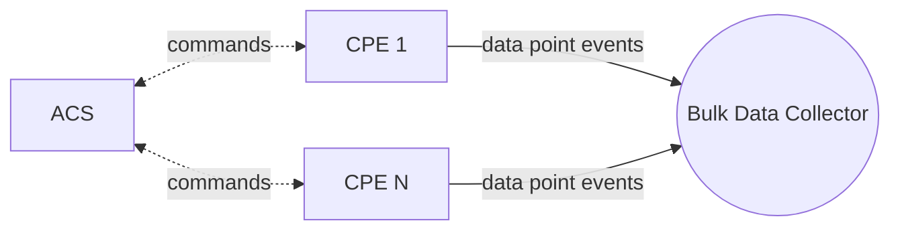
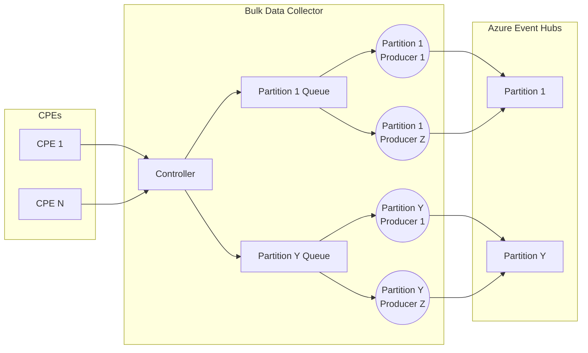
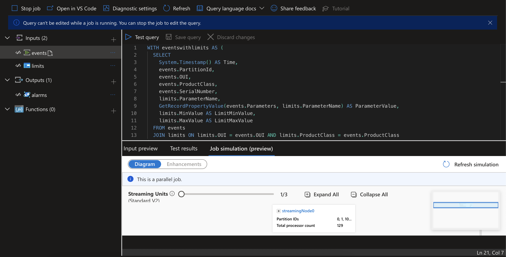
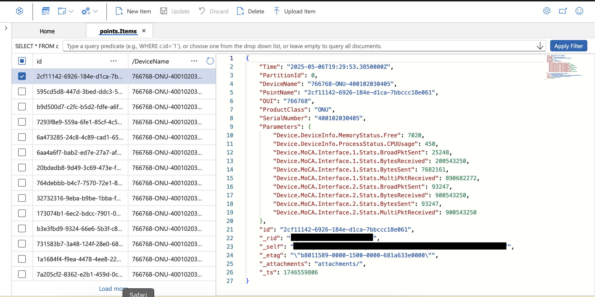
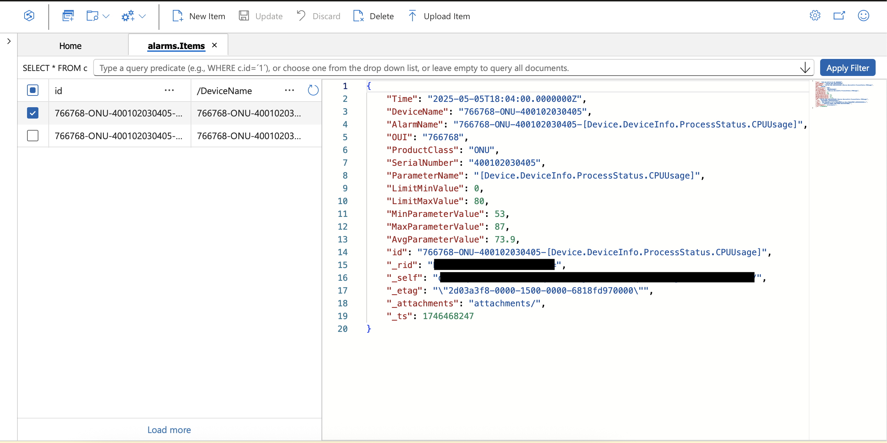
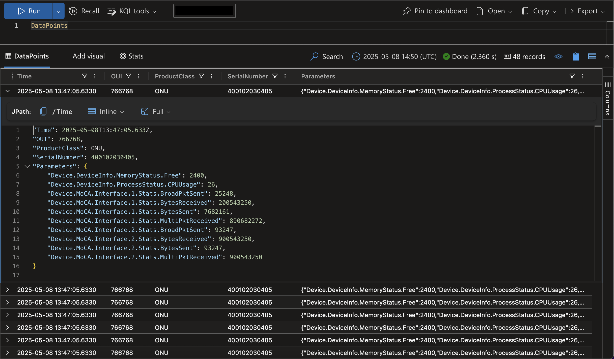
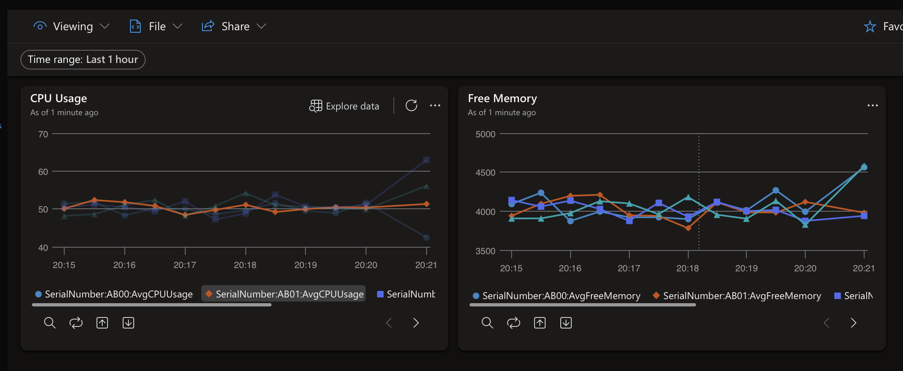
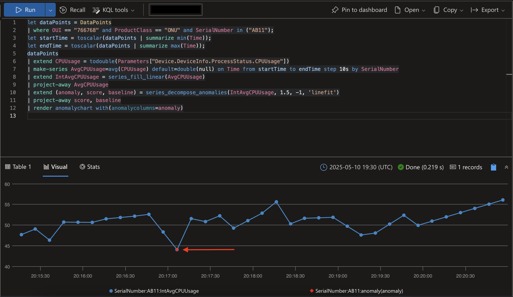
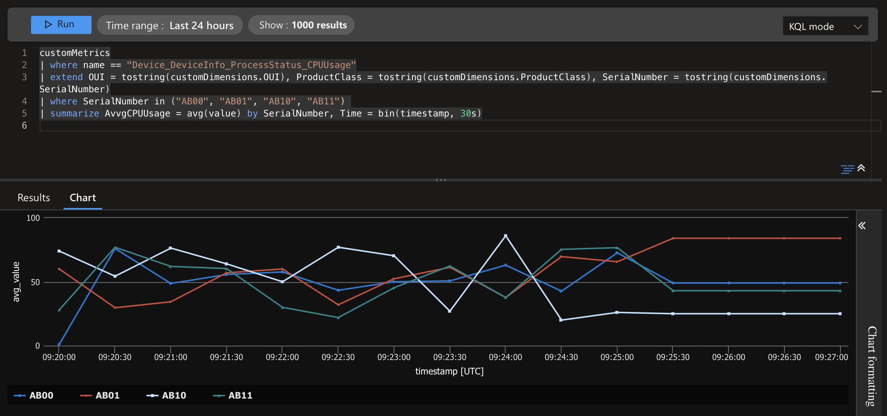
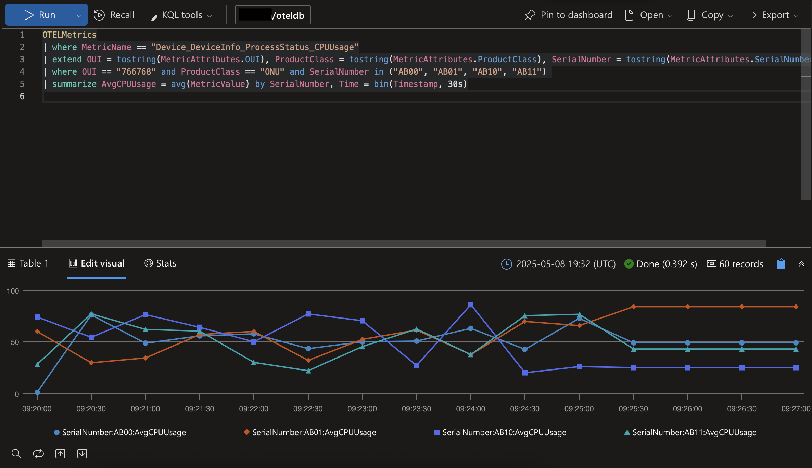

# CWMP and USP bulk data collector

## Overview

In the telecom industry, CWMP (also known as TR-069) is a widely adopted protocol and a preferred solution for ISPs to remotely manage anywhere from tens of thousands to millions of customer premises devices. The protocol defines two main roles: the CPE (Customer Premises Equipment) devices and the ACS (Auto-Configuration Server), which controls them.

Being SOAP-based, CWMP is well-suited for remote device management, but presents challenges when collecting large volumes of telemetry data from the devices. To address this, an extension to the protocol allows devices to periodically submit bulk data reports in CSV or JSON format to a separate endpoint known as bulk data collector.

This option not only provides a more efficient data format, but also decouples the telemetry data plane from the control plane used by the ACS. In other words, you are not limited to sending telemetry to the ACS itself (or to the component of the ACS solution responsible for this). Instead, you can send telemetry data to a dedicated analytics or telemetry platform — solutions that are often more scalable and capable than those provided by traditional ACS systems.

This repository explores several practical options for implementing this approach.

- [Azure Event Hubs](#azure-event-hubs)
- [OpenTelemetry (OTel)](#opentelemetry-otel)
- [MQTT](#mqtt)
- [Dapr](#dapr)

> [!NOTE]
> A newer protocol — USP (also known as TR-369) - aims to replace CWMP. It offers better performance, modern communication patterns, and enhanced capabilities, but it is not yet widely adopted. USP uses the same mechanism for telemetry data collection as CWMP, so the same approach can also be used with USP.

## Context



## Azure Event Hubs

This variant of the collector sends the collected data to [Azure Events Hubs](https://learn.microsoft.com/en-us/azure/event-hubs/event-hubs-about) - the main Azure real-time data ingestion service. Once the data is ingested into Event Hubs, there is a large number of real-time stream processing, data analytics and data storage services that you can use to extract insights from it.

The Azure Event Hubs collector variant is relatively more complex than the others. It is worth taking a look at its internal components so you can configure it to work efficiently.



When the collector starts, it queries the Event Hub management API to retrieve the number of partitions and their IDs. For each partition, the collector creates a dedicated in-memory queue and launches a configurable number of consumers. These consumers — referred to as "partition producers" — concurrently dequeue events from their queue, aggregate the events into batches, and send those batches to the assigned Event Hub partition.

**When receiving reports from devices, the collector aims to distribute events evenly across all partition queues, while ensuring that all events from the same device are routed to the same partition queue.** This behavior is often preferred or even required by the downstream processing engines to efficiently support some advanced stream processing patterns.

### Available configuration options

| Name | Default | Optional | Description |
|--|--|--|--|
| AZURE_EVENTHUBS_CONNECTION_STRING | | | Azure Event Hubs connection string. |
| AZURE_EVENTHUBS_EVENTHUB | | | Azure Event Hub name. |
| PARTITION_QUEUE_LIMIT | 1000 | Yes | Capacity of each partition queue. |
| PARTITION_PRODUCERS_COUNT | 1 | Yes | Number of partition producers per partition queue. |

> [!IMPORTANT]
> You should run a series of experiments to determine the optimal values for the PARTITION_QUEUE_LIMIT and PARTITION_PRODUCERS_COUNT parameters based on your specific scenario. These values will largely depend on your Event Hubs configuration — such as the pricing tier, the number of provisioned Throughput/Processing/Capacity Units, and the number of partitions — as well as your target event ingestion rate.
> 
> To assist with this task, the collector exports the following OTel metrics:
> - partition_queue_counter – The number of events currently in each partition queue.
> - partition_batch_counter – The number of batches sent to each Event Hub partition.
> - partition_event_counter – The number of events sent to each Event Hub partition.
> 
> When used alongside the Event Hubs telemetry available in the Azure portal, these metrics provide good visibility to the pipeline performance.

### Example 1 - use Azure Stream Analytics to process incoming events in real time, trigger alerts based on defined conditions, and store both events and alerts in Azure Cosmos DB

Among the many options available in Azure for processing the ingested data, you can use [Azure Stream Analytics](https://learn.microsoft.com/en-us/azure/stream-analytics/) to monitor the devices' CPU and memory usage in real time, at scale. The stream processing job can trigger an alarm and store it in [Azure Cosmos DB](https://learn.microsoft.com/en-us/azure/cosmos-db/) when the average CPU utilization or available memory on any device crosses predefined thresholds.

In scenarios like this, it is common practice to store the threshold configuration as JSON blob in Azure Storage Blob container. The stream processing job can read this blob and use it as reference data to join with the event stream.

1. Create a storage account and a blob container "alarms". Create `limits/limits.json` blob containing the tresholds.

```json
// limits/limits.json

[
  {
    "OUI": "766768",
    "ProductClass": "ONU",
    "ParameterName" : "[Device.DeviceInfo.ProcessStatus.CPUUsage]",
    "MinValue": 0,
    "MaxValue": 80
  },
  {
    "OUI": "766768",
    "ProductClass": "ONU",
    "ParameterName" : "[Device.DeviceInfo.MemoryStatus.Free]",
    "MinValue": 256,
    "MaxValue": 2147483647
  }
]
```

2. Create a Cosmos DB account. Open [Azure Cosmos DB Data Explorer](https://cosmos.azure.com) and create a database "collector" and containers "points" and "alarms". Set the partition key to `/DeviceName` for both containers. Set the default TTL for the "alarms" collection to 10 minutes to ensure that alarms are automatically deleted 10 minutes after their last update by the Stream Analytics job.

3. Create a Stream Analytics job with the following inputs, outputs and SAQL query:

Inputs:

- "events" connected to the Event Hub in which the bulk data collector ingests events. Do not use the default consumer group `$Default`. Create a dedicated consumer group instead.
- "limits" connected to the `limits/limits.json` blob.

Outputs:

- "points" connected to the Cosmos DB collection "points". Set `PointName` as "Document ID" field.
- "alarms" connected to the Cosmos DB collection "alarms". Set `AlarmName` as "Document ID" field.

SAQL Query:

```sql
WITH eventswithlimits AS (
  SELECT
    System.Timestamp() AS Time,
    events.PartitionId,
    events.OUI,
    events.ProductClass,
    events.SerialNumber,
    limits.ParameterName,
    GetRecordPropertyValue(events.Parameters, limits.ParameterName) AS ParameterValue,
    limits.MinValue AS LimitMinValue,
    limits.MaxValue AS LimitMaxValue
  FROM events
  JOIN limits ON limits.OUI = events.OUI AND limits.ProductClass = events.ProductClass
)

SELECT
  System.Timestamp() AS Time,
  PartitionId,
  OUI + '-' + ProductClass + '-' + SerialNumber AS DeviceName,
  GetMetadataPropertyValue(events, 'EventId') AS PointName,
  OUI,
  ProductClass,
  SerialNumber,
  Parameters
INTO points
FROM events

SELECT
  System.Timestamp() AS Time,
  PartitionId,
  OUI + '-' + ProductClass + '-' + SerialNumber AS DeviceName,
  OUI + '-' + ProductClass + '-' + SerialNumber + '-' + ParameterName AS AlarmName,
  OUI,
  ProductClass,
  SerialNumber,
  ParameterName,
  LimitMinValue,
  LimitMaxValue,
  MIN(ParameterValue) AS MinParameterValue,
  MAX(ParameterValue) AS MaxParameterValue,
  AVG(ParameterValue) AS AvgParameterValue
INTO alarms
FROM eventswithlimits
GROUP BY
  TumblingWindow(minute, 1),
  PartitionId,
  OUI,
  ProductClass,
  SerialNumber,
  ParameterName,
  LimitMinValue,
  LimitMaxValue
-- Trigger the alarm if any parameter value within the selected time window exceeds the specified limits.
HAVING MIN(ParameterValue) < LimitMinValue OR MAX(ParameterValue) > LimitMaxValue
-- Trigger the alarm if the average parameter value for the selected time window exceeds the specified limits.
-- HAVING AVG(ParameterValue) NOT BETWEEN LimitMinValue AND LimitMaxValue
```

The Stream Analytics job should look like the screenshot below:



4. Add `config.env` to `cmd/azureeventhubs`

```env
# cmd/azureeventhubs/config.env

AZURE_EVENTHUBS_CONNECTION_STRING=<Add the Event Hubs connection string here>
AZURE_EVENTHUBS_EVENTHUB=<Add the Event Hub name here>
PARTITION_QUEUE_LIMIT=100
PARTITION_PRODUCERS_COUNT=1
```

5. Run Prometheus and Grafana (this is required only if you need to monitor the pipeline performance)

```shell
cd prometheus
docker compose --profile grafana up -d
```

Open the Prometheus [dashboard](http://localhost:9090) or Grafana [dashboard](http://localhost:3000).

Create a graph with the following metrics to monitor the number of events processed per partition

```promql
partition_queue_counter{partition=~".*"}
partition_batch_counter_total{partition=~".*"}
partition_event_counter_total{partition=~".*"}
```

or alternatively, use the following aggregate metrics to monitor the total event volume flowing through the entire pipeline

```promql
sum (partition_queue_counter)
sum (partition_batch_counter_total)
sum (partition_event_counter_total)
```

6. Run the Bulk Data Collector

```shell
cd cmd/azureeventhubs
go run main.go
```

7. Run the test

```shell
cd grafana/k6
k6 run collector.js
```

In [Azure Cosmos DB Data Explorer](https://cosmos.azure.com), open the "collector" database and the "points" and "alarms" containers.

Data points collected in the "points" container: 



CPU usage alarm in the "alarms" container:



### Example 2 - use Azure Data Explorer to perform advanced real-time analysis on the collected events

1. Create a Data Explorer cluster. Open [Azure Data Explorer](https://dataexplorer.azure.com) and create a new database. Run the following [Kusto](https://learn.microsoft.com/en-us/kusto/) commands to create the necessary schema.

```kusto
.create-merge table DataPoints (Time:datetime, OUI:string, ProductClass:string, SerialNumber:string, Parameters:dynamic)

.create table DataPoints ingestion json mapping "DataPoints_mapping" '[{"column":"Time", "Properties":{"Path":"$.x-opt-enqueued-time"}},{"column":"OUI", "Properties":{"Path":"$.OUI"}},{"column":"ProductClass", "Properties":{"Path":"$.ProductClass"}},{"column":"SerialNumber", "Properties":{"Path":"$.SerialNumber"}},{"column":"Parameters", "Properties":{"Path":"$.Parameters"}}]'

.alter table DataPoints policy streamingingestion enable
```

2. Add `config.env` to `cmd/azureeventhubs`

```env
# cmd/azureeventhubs/config.env

AZURE_EVENTHUBS_CONNECTION_STRING=<Add the Event Hubs connection string here>
AZURE_EVENTHUBS_EVENTHUB=<Add the Event Hub name here>
PARTITION_QUEUE_LIMIT=100
PARTITION_PRODUCERS_COUNT=1
```

3. Run Prometheus and Grafana (this is required only if you need to monitor the pipeline performance)

```shell
cd prometheus
docker compose --profile grafana up -d
```

Open the Prometheus [dashboard](http://localhost:9090) or the Grafana [dashboard](http://localhost:3000). Create a graph with the following metrics to monitor the number of events processed per partition

```promql
partition_queue_counter{partition=~".*"}
partition_batch_counter_total{partition=~".*"}
partition_event_counter_total{partition=~".*"}
```

or alternatively, use the following aggregate metrics to monitor the total event volume flowing through the entire pipeline

```promql
sum (partition_queue_counter)
sum (partition_batch_counter_total)
sum (partition_event_counter_total)
```

4. Run the Bulk Data Collector

```shell
cd cmd/azureeventhubs
go run main.go
```

5. Run the test

```shell
cd grafana/k6
k6 run collector.js
```

In [Azure Data Explorer](https://dataexplorer.azure.com) run the following [Kusto](https://learn.microsoft.com/en-us/kusto/) query to visualize the collected data points.

```kusto
DataPoints
```



Run the following [Kusto](https://learn.microsoft.com/en-us/kusto/) queries to visualize the CPU usage and free memory of devices with serial numbers "AB00", "AB01", "AB10" and "AB11".

```kusto
DataPoints
| where OUI == "766768" and ProductClass == "ONU" and SerialNumber in ("AB00", "AB01", "AB10", "AB11")
| extend CPUUsage = todouble(Parameters["Device.DeviceInfo.ProcessStatus.CPUUsage"])
| summarize AvgCPUUsage = avg(CPUUsage) by SerialNumber, Time = bin(Time, 30s)
| render linechart

DataPoints
| where OUI == "766768" and ProductClass == "ONU" and SerialNumber in ("AB00", "AB01", "AB10", "AB11")
| extend FreeMemory = todouble(Parameters["Device.DeviceInfo.MemoryStatus.Free"])
| summarize AvgFreeMemory = avg(FreeMemory) by SerialNumber, Time = bin(Time, 30s)
| render linechart
```

Pin the line chart visuals to a dashboard.



Run the following [Kusto](https://learn.microsoft.com/en-us/kusto/) queries to analyse the series of and detect anomalies in the CPU usage of device with serial numbers "AB11".

```kusto
let dataPoints = DataPoints
| where OUI == "766768" and ProductClass == "ONU" and SerialNumber in ("AB11");
let startTime = toscalar(dataPoints | summarize min(Time));
let endTime = toscalar(dataPoints | summarize max(Time));
dataPoints
| extend CPUUsage = todouble(Parameters["Device.DeviceInfo.ProcessStatus.CPUUsage"])
| make-series AvgCPUUsage=avg(CPUUsage) default=double(null) on Time from startTime to endTime step 10s by SerialNumber
| extend IntAvgCPUUsage = series_fill_linear(AvgCPUUsage)
| project-away AvgCPUUsage
| extend (anomaly, score, baseline) = series_decompose_anomalies(IntAvgCPUUsage, 1.5, -1, 'linefit')
| project-away score, baseline
| render anomalychart with(anomalycolumns=anomaly)
```



## OpenTelemetry (OTel)

This variant of the collector works very differently — it uses a configurable mapping to extract selected properties from device reports and convert them into OTel metrics. These metrics are then periodically exported via the OTLP protocol to any [OpenTelemetry (OTel)](https://opentelemetry.io/docs/what-is-opentelemetry/) compatible collector. This enables direct integration of selected device metrics with a wide range of observability platforms.

### Example 1 - Transform the collected events into metrics, use the OpenTelemetry (OTel) collector to process and export the metrics to both Azure Monitor and Azure Data Explorer

You can use [OpenTelemetry Collector Contrib](https://github.com/open-telemetry/opentelemetry-collector-contrib/) distribution with [Azure Monitor](https://learn.microsoft.com/en-us/azure/azure-monitor/) and [Azure Data Explorer](https://learn.microsoft.com/en-us/azure/data-explorer/) exporters to export the collected metrics to Azure Monitor and Azure Data Explorer simultaneously.

1. Create an Application Insights instance and a Log Analytics workspace (both are components of Azure Monitor). Create a Data Explorer cluster. Open [Azure Data Explorer](https://dataexplorer.azure.com) and create a database "oteldb". Run the following [Kusto](https://learn.microsoft.com/en-us/kusto/) commands to create the necessary schema.

```kusto
.create-merge table OTELLogs (Timestamp:datetime, ObservedTimestamp:datetime, TraceID:string, SpanID:string, SeverityText:string, SeverityNumber:int, Body:string, ResourceAttributes:dynamic, LogsAttributes:dynamic)
.create-merge table OTELMetrics (Timestamp:datetime, MetricName:string, MetricType:string, MetricUnit:string, MetricDescription:string, MetricValue:real, Host:string, ResourceAttributes:dynamic,MetricAttributes:dynamic)
.create-merge table OTELTraces (TraceID:string, SpanID:string, ParentID:string, SpanName:string, SpanStatus:string, SpanKind:string, StartTime:datetime, EndTime:datetime, ResourceAttributes:dynamic, TraceAttributes:dynamic, Events:dynamic, Links:dynamic)

.alter-merge table OTELTraces (SpanStatusMessage:string)

.alter table OTELLogs policy streamingingestion enable
.alter table OTELMetrics policy streamingingestion enable
.alter table OTELTraces policy streamingingestion enable

.add database oteldb ingestors ('aadapp=<Add Microsoft Entra ID app ID here>') 'Azure Data Explorer App Registration'
```

2. Add `config.yaml` to `otelcol-contrib`

```yaml
# cmd/otelcol-contrib/config.yaml

receivers:
  otlp:
    protocols:
      grpc:
       endpoint: "0.0.0.0:4317"
      http:
        endpoint: "0.0.0.0:4318"
processors:
  batch:
    timeout: 10s
    send_batch_size: 512
    send_batch_max_size: 1024
exporters:
  azuremonitor:
      connection_string: <Add Azure Monitor Application Insights connection string here>
  azuredataexplorer:
    cluster_uri: <Add the Azure Data Explorer URL here>
    tenant_id: <Add the Azure tenant ID here>
    application_id: <Add the application ID here>
    application_key: <Add the application key here>
    # db_name: "oteldb"
    # logs_table_name: "OTELLogs"
    # metrics_table_name: "OTELMetrics"
    # traces_table_name: "OTELTraces"
    # logs_table_json_mapping: "otellogs_mapping"
    # metrics_table_json_mapping: "otelmetrics_mapping"
    # traces_table_json_mapping: "oteltraces_mapping"
    ingestion_type: "managed"
service:
  pipelines:
    logs:
      receivers: [otlp]
      processors: [batch]
      exporters: [azuredataexplorer]
    metrics:
      receivers: [otlp]
      processors: [batch]
      exporters: [azuremonitor, azuredataexplorer]
    traces:
      receivers: [otlp]
      processors: [batch]
      exporters: [azuredataexplorer]
```

This configures the OTel collector to accept metrics on standard OTLP ports and then to export them to Azure Monitor and Azure Data Explorer simultaneously.

3. Add an empty `config.env` to `cmd/otel`

```env
# cmd/otel/config.env

```

4. Add `config.yaml` to `cmd/otel`

```yaml
# cmd/otel/config.yaml

otel:
  meter:
    name: "collector"
    instruments:
      - parameterName: "Device.DeviceInfo.ProcessStatus.CPUUsage"
        name: "Device_DeviceInfo_ProcessStatus_CPUUsage"
        kind: "Int64Gauge"
        description: "Process CPU usage"
        unit: "percent"
      - parameterName: "Device.DeviceInfo.MemoryStatus.Total"
        name: "Device_DeviceInfo_MemoryStatus_Total"
        kind: "Int64Gauge"
        description: "Total memory"
        unit: "byte"
      - parameterName: "Device.DeviceInfo.MemoryStatus.Free"
        name: "Device_DeviceInfo_MemoryStatus_Free"
        kind: "Int64Gauge"
        description: "Free memory"
        unit: "byte"
      - parameterName: "Device.Ethernet.Interface.1.Stats.BytesSent"
        name: "Device_Ethernet_Interface_1_Stats_BytesSent"
        kind: "Int64Counter"
        description: "Ethernet bytes sent"
        unit: "byte"
      - parameterName: "Device.Ethernet.Interface.1.Stats.BytesReceived"
        name: "Device_Ethernet_Interface_1_Stats_BytesReceived"
        kind: "Int64Counter"
        description: "Ethernet bytes received"
        unit: "byte"
      - parameterName: "Device.MoCA.Interface.1.Stats.BytesSent"
        name: "Device_MoCA_Interface_1_Stats_BytesSent"
        kind: "Int64Counter"
        description: "MoCA bytes sent"
        unit: "byte"
      - parameterName: "Device.MoCA.Interface.1.Stats.BytesReceived"
        name: "Device_MoCA_Interface_1_Stats_BytesReceived"
        kind: "Int64Counter"
        description: "MoCA bytes received"
        unit: "byte"
```

This configures the bulk data collector to capture "Device.DeviceInfo.ProcessStatus.CPUUsage", "Device.DeviceInfo.MemoryStatus.Free", etc. properties from the CPE reports, to transform them to OTel metrics "Device_DeviceInfo_ProcessStatus_CPUUsage", "Device_DeviceInfo_MemoryStatus_Free", etc. and then to export those metrics to the running OTel collector.

5. Run the OTel Contrib collector

```shell
cd otelcol-contrib
docker compose up -d
```

6. Run the Bulk Data Collector

```shell
cd cmd/otel
go run main.go
```

7. Run the test

```shell
cd grafana/k6
k6 run collector.js
```

In the Application Insights instance or in the Log Analytics workspace open Logs and run the following [Kusto](https://learn.microsoft.com/en-us/kusto/) query to visualize CPU usage metric of devices with serial numbers "AB00", "AB01", "AB10" and "AB11".

```kusto
customMetrics
| where name == "Device_DeviceInfo_ProcessStatus_CPUUsage"
| extend OUI = tostring(customDimensions.OUI), ProductClass = tostring(customDimensions.ProductClass), SerialNumber = tostring(customDimensions.SerialNumber)
| where OUI == "766768" and ProductClass == "ONU" and SerialNumber in ("AB00", "AB01", "AB10", "AB11")
| summarize AvgCPUUsage = avg(value) by SerialNumber, Time = bin(timestamp, 30s)
| render linechart
```



In [Azure Data Explorer](https://dataexplorer.azure.com), run the following [Kusto](https://learn.microsoft.com/en-us/kusto/) query to visualize CPU usage metric of devices with serial numbers "AB00", "AB01", "AB10" and "AB11".

```kusto
OTELMetrics
| where MetricName == "Device_DeviceInfo_ProcessStatus_CPUUsage"
| extend OUI = tostring(MetricAttributes.OUI), ProductClass = tostring(MetricAttributes.ProductClass), SerialNumber = tostring(MetricAttributes.SerialNumber)
| where OUI == "766768" and ProductClass == "ONU" and SerialNumber in ("AB00", "AB01", "AB10", "AB11")
| summarize AvgCPUUsage = avg(MetricValue) by SerialNumber, Time = bin(Timestamp, 30s)
| render linechart
```



## MQTT

This variant of the collector sends the collected data to any MQTT v5 compatible broker.

### Example 1

You can use [Azure Event Grid](https://learn.microsoft.com/en-us/azure/event-grid/) with MQTT feature enabled.

1. Add the cert and key files to `cmd/mqtt`

2. Add `config.env` to `cmd/mqtt`

```env
# cmd/mqtt/config.env

MQTT_SERVER_URL=<Add the MQTT server URL here>
MQTT_CERT_FILE=<Add the cert file here>
MQTT_KEY_FILE=<Add the key file here>
MQTT_CLIENT_ID=<Add the MQTT client ID here>
MQTT_CONNECT_USERNAME=<Add the MQTT connect username here>
MQTT_CONNECT_PASSWORD=<Add the MQTT connect password here>
TOPIC_NAME=<Add the topic name here>
```

3. Run the bulk data collector

```shell
cd cmd/mqtt
go run main.go
```

4. Run the test

```shell
cd grafana/k6
k6 run collector.js
```

Work in progress...

## Dapr

Work in progress...

### Example 1

Work in progress...
