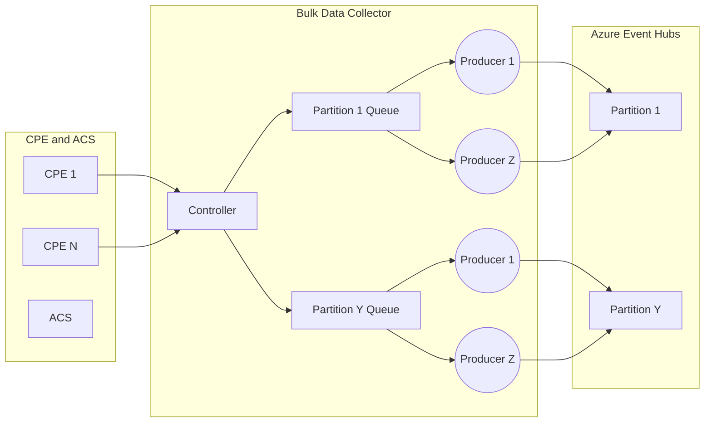

# CWMP and USP bulk data collector

## Overview

In telecom industry, CWMP (or TR-069) is a widely adopted protocol - one of the best options for the ISPs to manage sometimes millions of CPE devices remotely. There are two main players in this protocol - the CPE (Customer Premises Equipment) devices and the ACS (Auto-Configuration Server) server that controls them. Being SOAP-based the protocol does a very good job at controlling the devices remotely, but presents challenges when it comes to collecting large amounts of telemetry data from the devices to the server. To address this, an extension to the protocol exists that allows you to use a separate endpoint where the devices periodically submit bulk data reports containing the values of the device parameters in CSV or JSON format. In addition to the more efficient format, this completely decouples the telemetry data plane from the data plane which the ACS uses to control the CPEs. **This means you have more options where to send the telemetry.** Instead of sending it to the ACS (or to a built-in component of the ACS solution resposible for this) you can choose to send it to a dedicated analytics or telemetry platform. These platforms are often more scalable and have more advanced capabilities than the ACS solution can offer. This repo explores a few such options.

- [Azure Event Hubs](#azure-event-hubs)
- [Open Telemetry](#open-telemetry)
- [MQTT](#mqtt)
- [Dapr](#dapr)

> [!NOTE]
> There is a newer, more capable and efficient gRPC based protocol - USP (or TR-369) that aims to replace CWMP but it is not yet widely adopted. USP uses the same mechanism for bulk data collection as CWMP, so the bulk data collector can also be used with USP.

## Concepts

Work in progress...

## Azure Event Hubs

This variant of the collector sends the collected data to [Azure Events Hubs](https://learn.microsoft.com/en-us/azure/event-hubs/event-hubs-about) - the main Azure real-time data ingestion service. Once the data is ingested into Event Hubs, there is a large number of real-time stream processing, data analytics and data storage services that you can use to extract insights from it.

The Azure Event Hubs collector variant is relatively more complex than the others. It is worth taking a look at its internal components so you can configure it effectively.

Work in progress...

## Open Telemetry

This variant of the collector sends the collected data to any [Open Telemetry](https://opentelemetry.io/docs/what-is-opentelemetry/) compatible collector. I will use [OpenTelemetry Collector Contrib](https://github.com/open-telemetry/opentelemetry-collector-contrib/) distribution with [Azure Data Explorer](https://learn.microsoft.com/en-us/azure/data-explorer/) exporter.

Work in progress...

## MQTT

This variant of the collector sends the collected data to any MQTT v5 compatible broker. I will use [Azure Event Grid](https://learn.microsoft.com/en-us/azure/event-grid/) with MQTT feature enabled.

Work in progress...

## Dapr

Work in progress...
