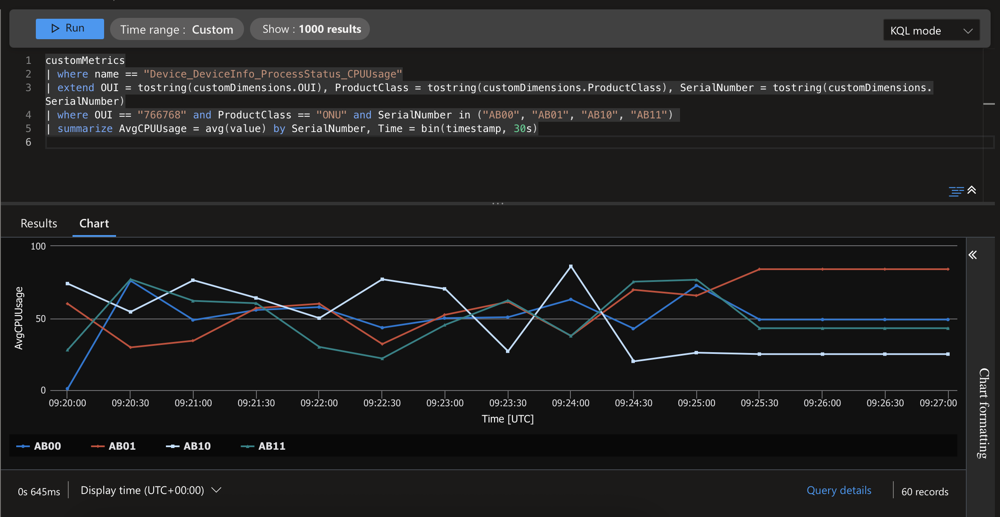
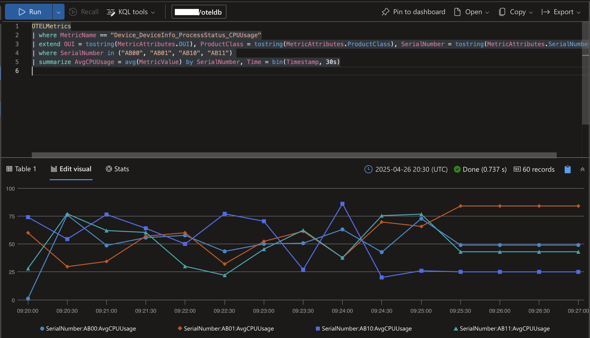

# CWMP and USP bulk data collector

## Overview

In the telecom industry, CWMP (also known as TR-069) is a widely adopted protocol — one of the best options for ISPs to remotely manage millions of devices. The protocol defines two main roles: the CPE (Customer Premises Equipment) devices and the ACS (Auto-Configuration Server), which controls them.

Being SOAP-based, CWMP is well-suited for remote device management, but presents challenges when collecting large volumes of telemetry data from the devices. To address this, an extension to the protocol allows devices to periodically submit bulk data reports in CSV or JSON format to a separate endpoint known as bulk data collector.

This option not only provides a more efficient data format, but also decouples the telemetry data plane from the control plane used by the ACS. In other words, you are not limited to sending telemetry to the ACS itself (or to the component of the ACS solution responsible for this). Instead, you can send telemetry data to a dedicated analytics or telemetry platform — solutions that are often more scalable and capable than those provided by traditional ACS systems.

This repository explores several practical options for implementing this approach.

- [Azure Event Hubs](#azure-event-hubs)
- [OpenTelemetry (OTel)](#opentelemetry-otel)
- [MQTT](#mqtt)
- [Dapr](#dapr)

> [!NOTE]
> A newer protocol — USP (also known as TR-369) - aims to replace CWMP. It offers better performance, modern communication patterns, and enhanced capabilities, but it is not yet widely adopted. USP uses the same mechanism for telemetry data collection as CWMP, so the same approach can also be used with USP.

## Context


## Azure Event Hubs

This variant of the collector sends the collected data to [Azure Events Hubs](https://learn.microsoft.com/en-us/azure/event-hubs/event-hubs-about) - the main Azure real-time data ingestion service. Once the data is ingested into Event Hubs, there is a large number of real-time stream processing, data analytics and data storage services that you can use to extract insights from it.

The Azure Event Hubs collector variant is relatively more complex than the others. It is worth taking a look at its internal components so you can configure it to work efficiently.


When the collector starts, it queries the Event Hub management API to retrieve the number of partitions and their IDs. For each partition, the collector creates a dedicated in-memory queue and launches a configurable number of consumers. These consumers — referred to as "partition producers" — concurrently dequeue events from their queue, aggregate the events into batches, and send those batches to the assigned Event Hub partition.

**When receiving reports from devices, the collector aims to distribute events evenly across all partition queues, while ensuring that all events from the same device are routed to the same partition queue.** This behavior is often preferred or even required by the downstream processing engines to efficiently support some advanced stream processing patterns.

### Available configuration options

| Name | Default | Optional | Description |
|--|--|--|--|
| AZURE_EVENTHUBS_CONNECTION_STRING | | | Azure Event Hubs connection string. |
| AZURE_EVENTHUBS_EVENTHUB | | | Azure Event Hub name. |
| PARTITION_QUEUE_LIMIT | 1000 | Yes | Capacity of each partition queue. |
| PARTITION_PRODUCERS_COUNT | 1 | Yes | Number of partition producers per partition queue. |

> [!IMPORTANT]
> You should run a series of experiments to determine the optimal values for the PARTITION_QUEUE_LIMIT and PARTITION_PRODUCERS_COUNT parameters based on your specific scenario. These values will largely depend on your Event Hubs configuration — such as the pricing tier, the number of provisioned Throughput/Processing/Capacity Units, and the number of partitions — as well as your target event ingestion rate.
> 
> To assist with this task, the collector exports the following OTel metrics:
> - partition_queue_counter – The number of events currently in each partition queue.
> - partition_batch_counter – The number of batches sent to each Event Hub partition.
> - partition_event_counter – The number of events sent to each Event Hub partition.
> 
> When used alongside the Event Hubs telemetry available in the Azure portal, these metrics provide good visibility to the pipeline performance.

### Example

1. Add `config.env` to `cmd/azureeventhubs`

```env
# cmd/azureeventhubs/config.env

AZURE_EVENTHUBS_CONNECTION_STRING=<Add the Event Hubs connection string here>
AZURE_EVENTHUBS_EVENTHUB=<Add the Event Hub name here>
PARTITION_QUEUE_LIMIT=100
PARTITION_PRODUCERS_COUNT=1
```

2. Run Prometheus and Grafana

```shell
cd prometheus
docker compose --profile grafana up -d
```

Open [Prometheus dashboard](http://localhost:9090) or [Grafana dashboard](http://localhost:3000).

Create a graph with the following metrics to monitor the number of events processed per partition

```promql
partition_queue_counter{partition=~".*"}

partition_batch_counter_total{partition=~".*"}

partition_event_counter_total{partition=~".*"}
```

or alternatively, use the following aggregate metrics to monitor the total event volume flowing through the entire pipeline

```promql
sum (partition_queue_counter)

sum (partition_batch_counter_total)

sum (partition_event_counter_total)
```

3. Run the bulk data collector

```shell
cd cmd/azureeventhubs
go run main.go
```

4. Run the test

```shell
cd grafana/k6
k6 run collector.js
```

Work in progress...

## OpenTelemetry (OTel)

This variant of the collector works very differently — it uses a configurable mapping to extract selected properties from device reports and convert them into OTel metrics. These metrics are then periodically exported via the OTLP protocol to any [OpenTelemetry (OTel)](https://opentelemetry.io/docs/what-is-opentelemetry/) compatible collector. This enables direct integration of selected device metrics with a wide range of observability platforms.

### Example

I will use [OpenTelemetry Collector Contrib](https://github.com/open-telemetry/opentelemetry-collector-contrib/) distribution with [Azure Data Explorer](https://learn.microsoft.com/en-us/azure/data-explorer/) and [Azure Monitor](https://learn.microsoft.com/en-us/azure/azure-monitor/) exporters.

1. Create the necessary tables in Azure Data Explorer

```kusto
.create-merge table OTELLogs (Timestamp:datetime, ObservedTimestamp:datetime, TraceID:string, SpanID:string, SeverityText:string, SeverityNumber:int, Body:string, ResourceAttributes:dynamic, LogsAttributes:dynamic)
.create-merge table OTELMetrics (Timestamp:datetime, MetricName:string, MetricType:string, MetricUnit:string, MetricDescription:string, MetricValue:real, Host:string, ResourceAttributes:dynamic,MetricAttributes:dynamic)
.create-merge table OTELTraces (TraceID:string, SpanID:string, ParentID:string, SpanName:string, SpanStatus:string, SpanKind:string, StartTime:datetime, EndTime:datetime, ResourceAttributes:dynamic, TraceAttributes:dynamic, Events:dynamic, Links:dynamic)

.alter-merge table OTELTraces (SpanStatusMessage:string)

.alter table OTELLogs policy streamingingestion enable
.alter table OTELMetrics policy streamingingestion enable
.alter table OTELTraces policy streamingingestion enable

.add database oteldb ingestors ('aadapp=<Add Microsoft Entra ID app ID here>') 'Azure Data Explorer App Registration'
```

2. Add `config.yaml` to `otelcol-contrib`

```yaml
# cmd/otelcol-contrib/config.yaml

receivers:
  otlp:
    protocols:
      grpc:
       endpoint: "0.0.0.0:4317"
      http:
        endpoint: "0.0.0.0:4318"
processors:
  batch:
    timeout: 10s
    send_batch_size: 512
    send_batch_max_size: 1024
exporters:
  azuremonitor:
      connection_string: <Add Azure Monitor Application Insights connection string here>
  azuredataexplorer:
    cluster_uri: <Add the Azure Data Explorer URL here>
    tenant_id: <Add the Azure tenant ID here>
    application_id: <Add the applicatioin ID here>
    application_key: <Add the application key here>
    # db_name: "oteldb"
    # logs_table_name: "OTELLogs"
    # metrics_table_name: "OTELMetrics"
    # traces_table_name: "OTELTraces"
    # logs_table_json_mapping: "otellogs_mapping"
    # metrics_table_json_mapping: "otelmetrics_mapping"
    # traces_table_json_mapping: "oteltraces_mapping"
    ingestion_type: "managed"
service:
  pipelines:
    logs:
      receivers: [otlp]
      processors: [batch]
      exporters: [azuredataexplorer]
    metrics:
      receivers: [otlp]
      processors: [batch]
      exporters: [azuremonitor, azuredataexplorer]
    traces:
      receivers: [otlp]
      processors: [batch]
      exporters: [azuredataexplorer]
```

This configures the OTel collector to accept metrics on standard OTLP ports and then to export them to Azure Monitor and Azure Data Explorer simultaneously.

3. Add `config.env` to `cmd/otel`

```env
# cmd/otel/config.env

```

4. Add `config.yaml` to `cmd/otel`

```yaml
# cmd/otel/config.yaml

otel:
  meter:
    name: "collector"
    instruments:
      - parameterName: "Device.DeviceInfo.ProcessStatus.CPUUsage"
        name: "Device_DeviceInfo_ProcessStatus_CPUUsage"
        kind: "Int64Gauge"
        description: "Process CPU usage"
        unit: "percent"
      - parameterName: "Device.DeviceInfo.MemoryStatus.Total"
        name: "Device_DeviceInfo_MemoryStatus_Total"
        kind: "Int64Gauge"
        description: "Total memory"
        unit: "byte"
      - parameterName: "Device.DeviceInfo.MemoryStatus.Free"
        name: "Device_DeviceInfo_MemoryStatus_Free"
        kind: "Int64Gauge"
        description: "Free memory"
        unit: "byte"
      - parameterName: "Device.Ethernet.Interface.1.Stats.BytesSent"
        name: "Device_Ethernet_Interface_1_Stats_BytesSent"
        kind: "Int64Counter"
        description: "Ethernet bytes sent"
        unit: "byte"
      - parameterName: "Device.Ethernet.Interface.1.Stats.BytesReceived"
        name: "Device_Ethernet_Interface_1_Stats_BytesReceived"
        kind: "Int64Counter"
        description: "Ethernet bytes received"
        unit: "byte"
      - parameterName: "Device.MoCA.Interface.1.Stats.BytesSent"
        name: "Device_MoCA_Interface_1_Stats_BytesSent"
        kind: "Int64Counter"
        description: "MoCA bytes sent"
        unit: "byte"
      - parameterName: "Device.MoCA.Interface.1.Stats.BytesReceived"
        name: "Device_MoCA_Interface_1_Stats_BytesReceived"
        kind: "Int64Counter"
        description: "MoCA bytes received"
        unit: "byte"
```

This configures Bulk Data Collector to capture "Device.DeviceInfo.ProcessStatus.CPUUsage", "Device.DeviceInfo.MemoryStatus.Free", etc. properties from the CPE reports, to transform them to OTel metrics "Device_DeviceInfo_ProcessStatus_CPUUsage", "Device_DeviceInfo_MemoryStatus_Free", etc. and then to export those metrics to the running OTel collector.

5. Run the OTel Contrib collector

```shell
cd otelcol-contrib
docker compose up -d
```

6. Run the bulk data collector

```shell
cd cmd/otel
go run main.go
```

7. Run the test

```shell
cd grafana/k6
k6 run collector.js
```

Open Azure Monitor and run the following query to visualize CPU Usage metric.

```kusto
customMetrics
| where name == "Device_DeviceInfo_ProcessStatus_CPUUsage"
| extend OUI = tostring(customDimensions.OUI), ProductClass = tostring(customDimensions.ProductClass), SerialNumber = tostring(customDimensions.SerialNumber)
| where SerialNumber in ("AB00", "AB01", "AB10", "AB11") 
| summarize AvvgCPUUsage = avg(value) by SerialNumber, Time = bin(timestamp, 30s)
```

Switch from Results to Chart tab. Change chart type to "Line".



Open [Azure Data Explorer](https://dataexplorer.azure.com). Add connection to your Azure Data Explorer cluster. Select the "oteldb" database and run the following query to visualize CPU Usage metric.

```kusto
OTELMetrics
| where MetricName == "Device_DeviceInfo_ProcessStatus_CPUUsage"
| extend OUI = tostring(MetricAttributes.OUI), ProductClass = tostring(MetricAttributes.ProductClass), SerialNumber = tostring(MetricAttributes.SerialNumber)
| where SerialNumber in ("AB00", "AB01", "AB10", "AB11") 
| summarize AvgCPUUsage = avg(MetricValue) by SerialNumber, Time = bin(Timestamp, 30s)
```

Add a line chart visual.



Work in progress...

## MQTT

This variant of the collector sends the collected data to any MQTT v5 compatible broker.

### Example

I will use [Azure Event Grid](https://learn.microsoft.com/en-us/azure/event-grid/) with MQTT feature enabled.

1. Add the cert and key files to `cmd/mqtt`

2. Add `config.env` to `cmd/mqtt`

```env
# cmd/mqtt/config.env

MQTT_SERVER_URL=<Add the MQTT server URL here>
MQTT_CERT_FILE=<Add the cert file here>
MQTT_KEY_FILE=<Add the key file here>
```

3. Run the bulk data collector

```shell
cd cmd/mqtt
go run main.go
```

4. Run the test

```shell
cd grafana/k6
k6 run collector.js
```

Work in progress...

## Dapr

Work in progress...

### Example

Work in progress...
